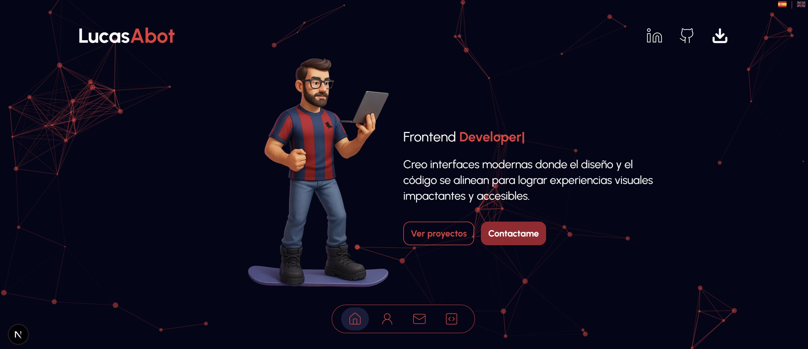
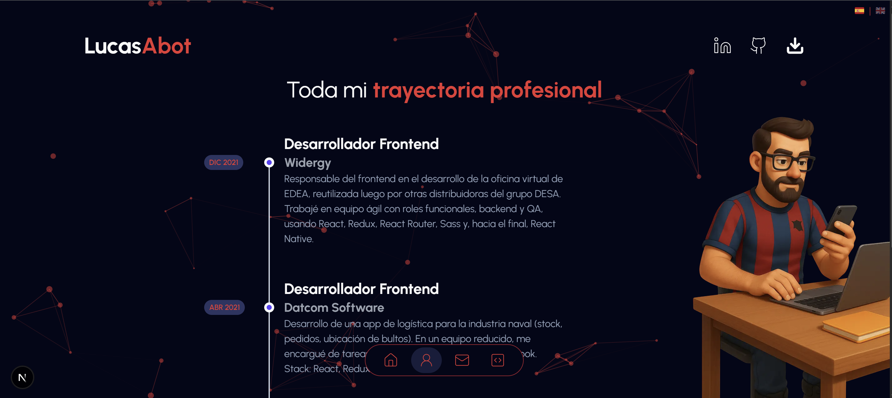
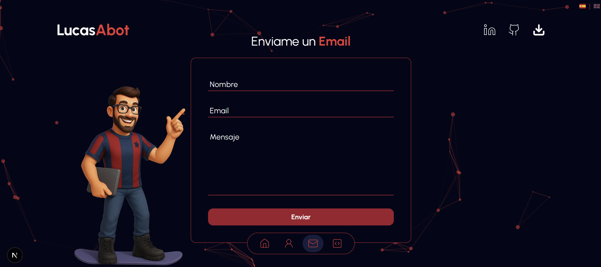
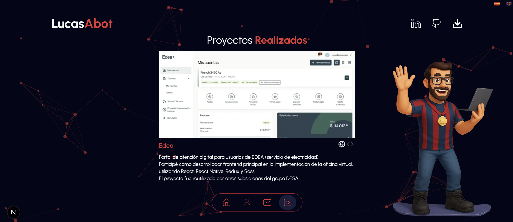

# 💻 Portfolio – Lucas Abot

Este es mi portfolio personal como desarrollador frontend, creado con [Next.js](https://nextjs.org/) y estilizado con [Tailwind CSS](https://tailwindcss.com/).  
Aquí muestro algunos de los proyectos más importantes en los que trabajé, junto con mi experiencia y formas de contacto.

🔗 [Ver sitio en producción](https://abotlucas.netlify.app)

---

## 🛠️ Stack utilizado

- ⚛️ Next.js 14 (App Router)
- 🎨 Tailwind CSS
- 🎞️ Swiper.js (para mostrar proyectos en slider)
- 🚀 Deploy en Netlify

---

## ✨ Funcionalidades principales

- Slider de proyectos con título, descripción y stack
- Sección de contacto
- Diseño responsive y enfocado en UI limpia
- Metadata optimizada para compartir en redes sociales (`og:title`, `og:image`, etc.)

---

## 📸 Capturas






---

## 🧪 Modo local (opcional)

Este proyecto está publicado como código abierto para fines de referencia.  
Si querés clonar o ejecutar localmente:

```bash
git clone https://github.com/lucasabot/portfolio.git
cd portfolio
npm install
npm run dev
